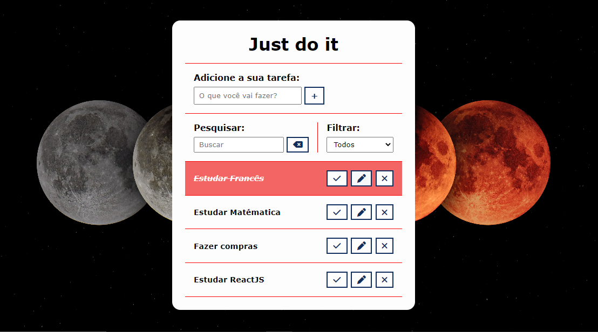

# Todo-List.

> Projeto Todo-List.

Esse projeto é um Todo-list desenvolvido com as tecnologias JavaScript, HTML e CSS.

Com esse projeto é possível inserir atividades que você tem a fazer no seu dia dia e assim que 
for concluído você pode finalizar e a atividade ficara com uma cor avermelhada.

Tela inicial:

## Tecnologias
- JavaScript
- HTML
- CSS
- Git e GitHub